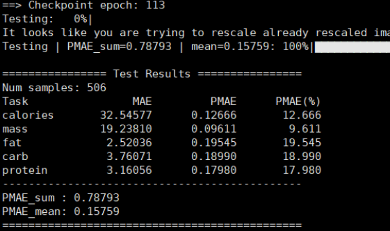

# 🎉 This work was accepted in ACM MM 2025!

---

## 🧾 Paper Information

<p align="center">

# Spatial-Aware Multi-Modal Information Fusion for Food Nutrition Estimation

</p>

<p align="center" style="font-size:small;">

Dongjian Yu¹, Weiqing Min², Xin Jin¹, Qian Jiang¹, Shuqiang Jiang²

</p>

<p align="center" style="font-size:small;">

¹ Yunnan University

</p>

<p align="center" style="font-size:small;">

² Key Laboratory of Intelligent Information Processing, Institute of Computing Technology, Chinese Academy of Sciences

</p>

### Please feel free to contact me at yudongjian@stu.ynu.edu.cn if you have any questions.

## 📄 Paper Link

[[📄 Paper Link]](https://doi.org/10.1145/3746027.3755750)  

## Prerequisite Step 1

Before using this project, please download the pre-trained weight files:  你首先需要下载预训练的权重文件：

[Download CLIP, Swin-Transforemer, ConvNext, Point-Transformer here](https://drive.google.com/drive/folders/1i-AExbFDi4cLy_OPYUmGm_q5f8EITpjJ?usp=drive_link)

After downloading, place the files in the `pth/` and  `point-transformer/` folder of the project (create the folder if it doesn't exist).
[Download DINO-V2 here](https://huggingface.co/facebook/dinov2-base/tree/main)

## Prerequisites Step 2

For training the 3D models, you need to set the paths to the pre-trained weights in advance.  You need to set the corresponding pre-trained weight path.

- **3D training**:  
  In `train3D-mm.py`, please configure the following paths:
  - `clip_path`  
  - `pth_path` (for **Swin-T** and **ConvNeXt** pre-trained weights) 
  - `checkpoint` (for **Point Transformer** ) 
  In `model/three_D.py`, please set the path to the **DINO** pre-trained weights (located at **line 174**).


## 🚧 Code Release Notice
generate 3D food point cloud
```bash
python pre_process2.py
```
# Train the model 
```bash
python train3D-mm.py --b 8 --log ./logs/log1
```
# Test the model 
```bash
python test.py --ckpt ./***/ckpt_best.pth
```


## 📚 Reference


```bash
@inproceedings{10.1145/3746027.3755750,
    author = {Yu, Dongjian and Min, Weiqing and Jin, Xin and Jiang, Qian and Jiang, Shuqiang},
    title = {Spatial-Aware Multi-Modal Information Fusion for Food Nutrition Estimation},
    year = {2025},
    isbn = {9798400720352},
    publisher = {Association for Computing Machinery},
    address = {New York, NY, USA},
    url = {https://doi.org/10.1145/3746027.3755750},
    doi = {10.1145/3746027.3755750},
    booktitle = {Proceedings of the 33rd ACM International Conference on Multimedia},
    pages = {8863–8871},
    numpages = {9},
    keywords = {deep learning, food computing, food nutrients estimation, multi-modal fusion},
    location = {Dublin, Ireland},
    series = {MM '25}
}
```

